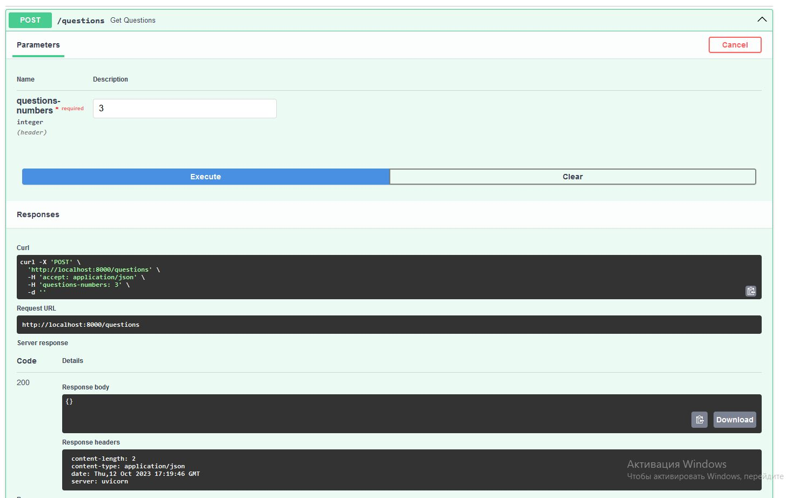
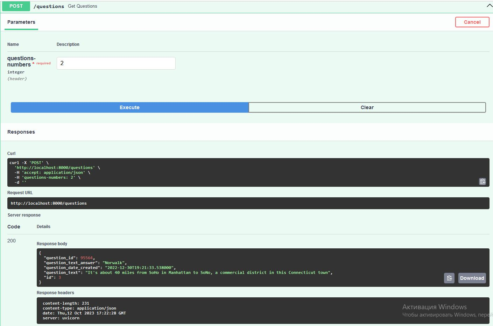

# Вопросы

Получает на вход количество вопросов, которые надо добавить в базу. Делаем запрос к внешнему api для получания указанного числа вопросов.
Сохраняем в базу вопросы и возвращаем последний вопрос из базы, сохраненный ранее

## клонируем репозиторий 

    mkdir app

    cd cat app

    git clone https://github.com/se-andrey/bewise_questions.git

### запуск
    docker-compose up --build 

### пример 
На первый запрос возвращаем пустой словарь, т.к. записей еще не было

На следующие запросы возвращаем последний вопрос, сохраненный до запроса

